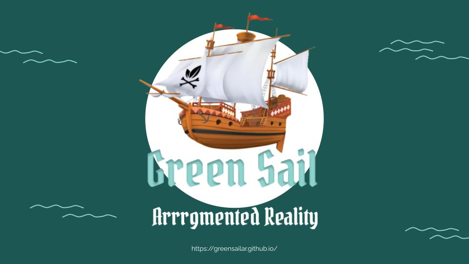
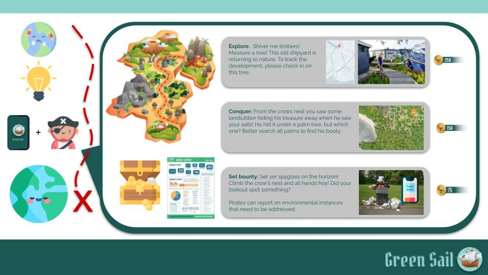
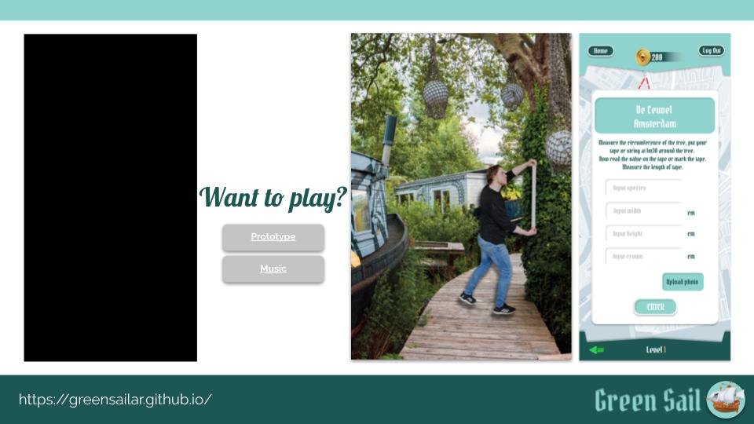
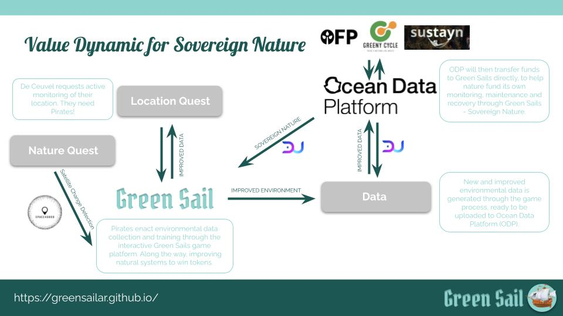
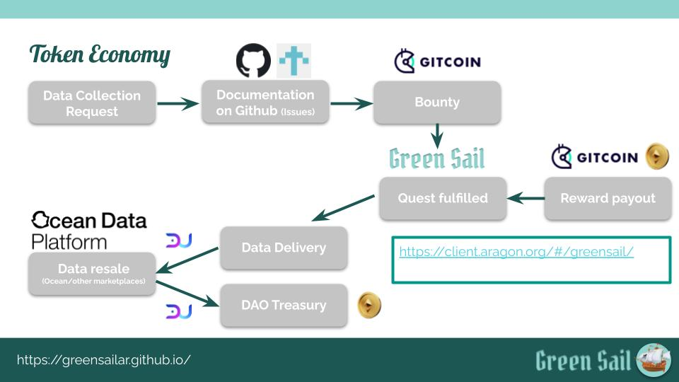

# Green Sails—Arrrgmented Reality for the SNI Winter Hack 

## Project Overview

| Project name        | Green Sails—Arrrgmented Reality                                    |
| :------------------ | ------------------------------------------------------------ |
| Product demo        | [Product Demo](https://www.figma.com/proto/i4BTI7grpM6qtRG0x7snvL/Green-Sail---Space4Good?node-id=23%3A239&scaling=scale-down&page-id=0%3A1&starting-point-node-id=2%3A22&show-proto-sidebar=1)                                |
| Demo video          | [Demo Video](https://www.youtube.com/watch?v=tK3G8Lu7N3g)                  |
| Blog post          | [TBA]                  |
| Dissemination level | Public                                                       |
| Version             | 0.1                                                          |
| Software license    | MIT License                                                  |
| Status              | Work in progress                                              |

<iframe width="560" height="315" src="https://www.youtube.com/embed/tK3G8Lu7N3g" title="YouTube video player" frameborder="0" allow="accelerometer; autoplay; clipboard-write; encrypted-media; gyroscope; picture-in-picture" allowfullscreen></iframe>

## Short Description

## Team 

- Alex
- Federico
- Jessica
- Lisa
- Robert
- Yannick

## Story

Data collection pirates! 

## Design / Development

- Ocean Marketplace fork
- DAO

## Whats Next?

- Doubloons!
- DAO
- Launch token

## Credits

Thanks and shoutouts to:

- SNI
- Everyone we missed

------

