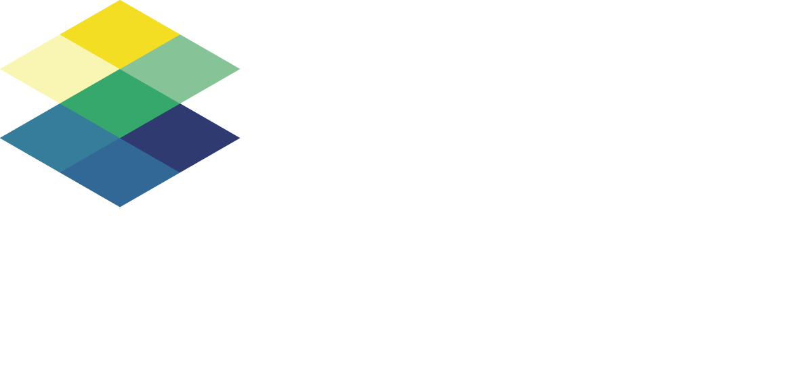

# Green Sails—Arrrgmented Reality for Nature

## An SNI Winter Hack Project

## Project Overview

| Project name        | Green Sails—Arrrgmented Reality                                    |
| :------------------ | ------------------------------------------------------------ |
| Product demo        | [Product Demo](https://www.figma.com/proto/i4BTI7grpM6qtRG0x7snvL/Green-Sail---Space4Good?node-id=23%3A239&scaling=scale-down&page-id=0%3A1&starting-point-node-id=2%3A22&show-proto-sidebar=1)                                |
| Demo video          | [Demo Video](https://www.youtube.com/watch?v=tK3G8Lu7N3g)                  |
| Blog post          | [TBA]                  |
| Dissemination level | Public                                                       |
| Version             | 0.1                                                          |
| Software license    | MIT License                                                  |
| Status              | Work in progress                                              |

## Short Description

## Team 

- Alex
- Federico
- Jessica
- Lisa
- Robert
- Yannick (https://github.com/IneffableKoD)

## An End-To-End Demo

- [DAO](https://client.aragon.org/#/greensail/)
- [First data collection request](https://github.com/greensailAR/SNIwinterhack/issues/2)
- [Corresponding bounty](https://gitcoin.co/issue/greensailar/sniwinterhack/2/100027600)
- [Corresponding DAO vote](https://client.aragon.org/#/greensail/0x71f8045034f0f4a57f46814df7983b4b27339ce6/vote/2/)

## Whats Next?

- Doubloons! on a main net
- DAO on a main net
- Ocean Marketplace fork deployment
- DAO council vote
- DAO treasury

## Shoutouts and Credits

Thanks and shoutouts to:

- Sovereign Nature Initiative (https://sovereignnature.com/)
- Everyone in the SNI Winter 2022 Hackathon
- Ale, Ed, Andrea, and all the brilliant minds we met

Credits: 

- https://www.space4good.com/
- https://ceven.tech/

 

------
